# Nicholas Teague's public portfolio website

## Scene previews:

### Snow:
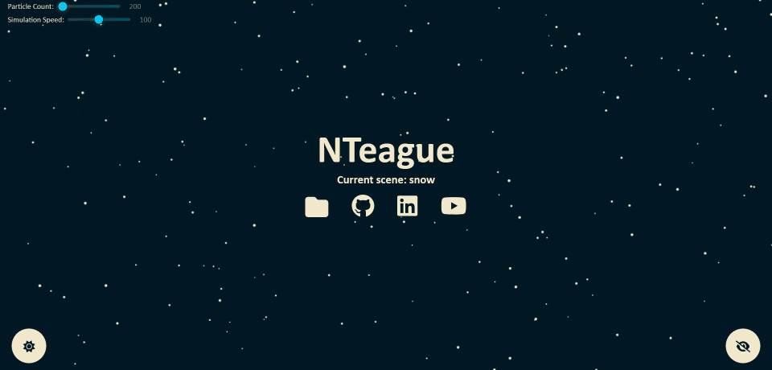

### Rain:

### Plants:
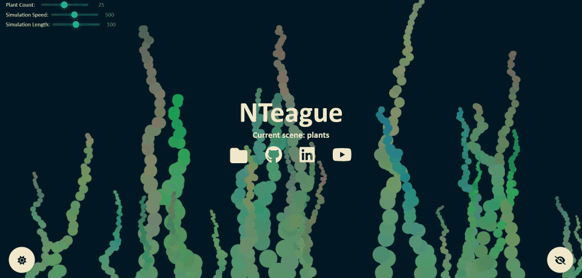

### Stars:
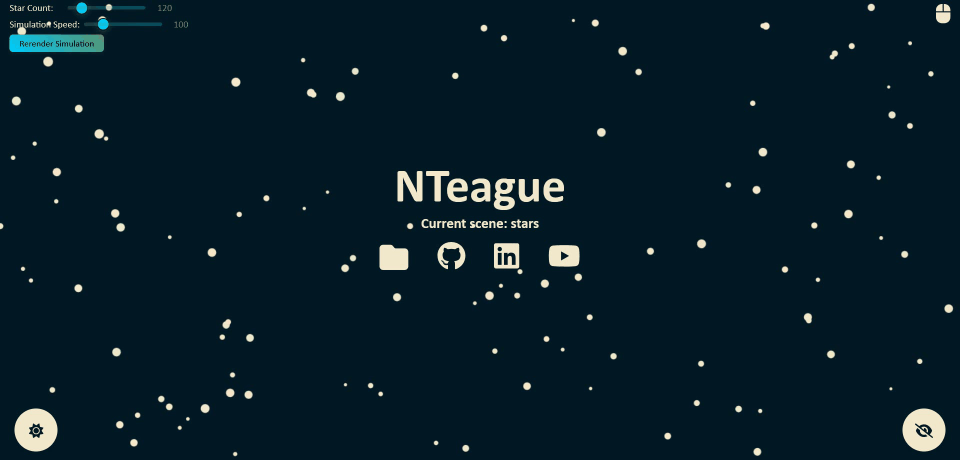

### Boids:
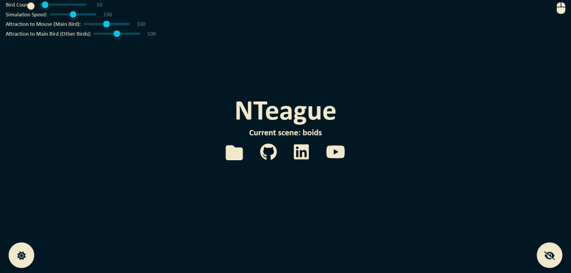

### Conway:
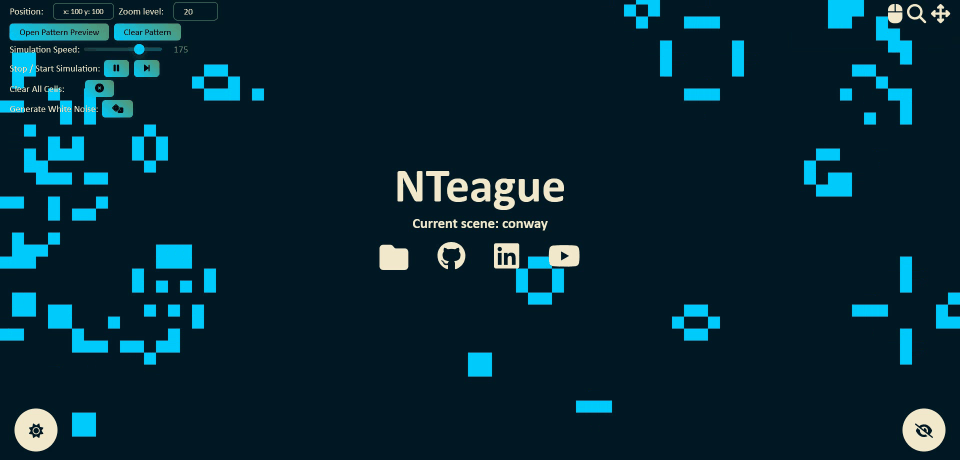

### Hexapod:
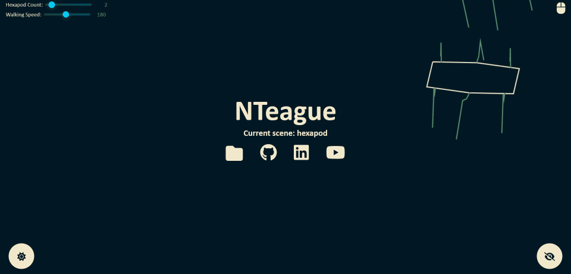

### Mandelbrot:
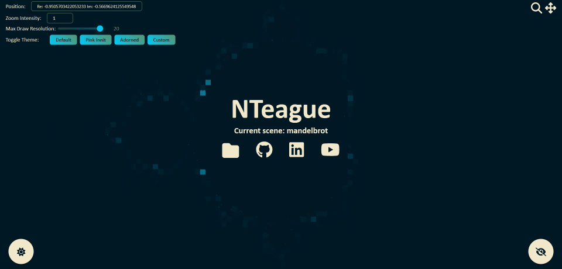

### Fire:
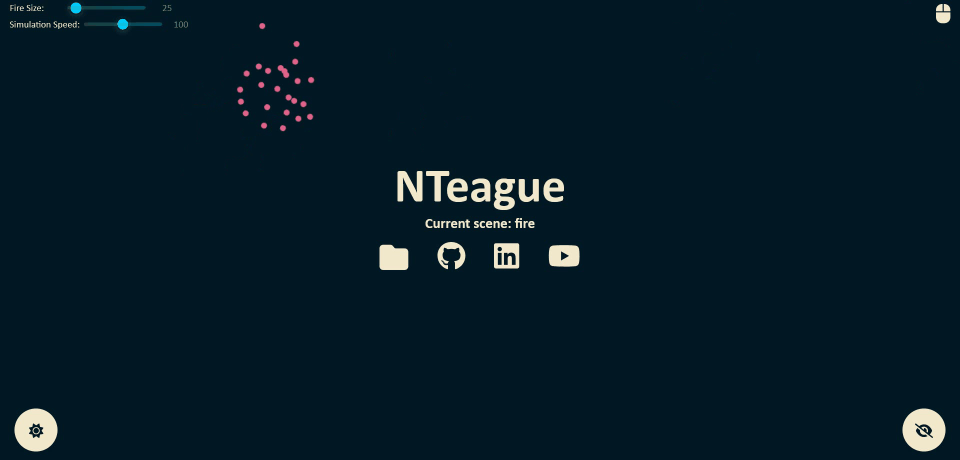

### Fireworks:
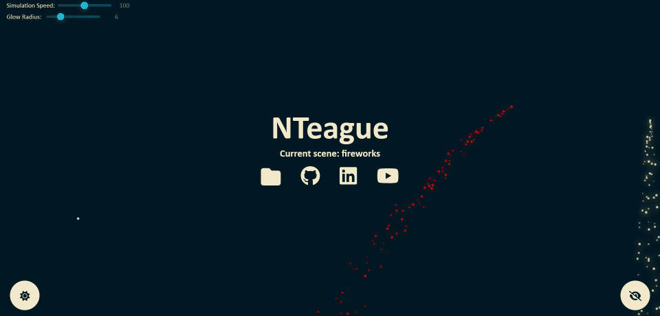

### Plinko:
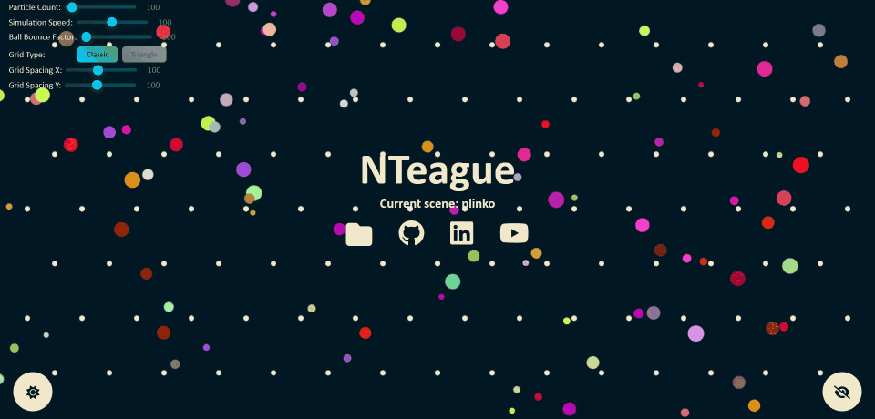

### Gravitalorbs:
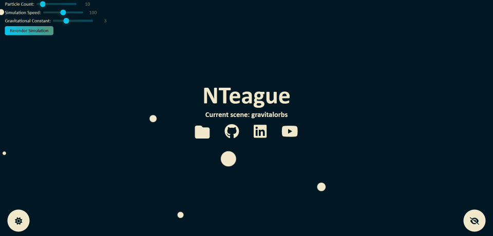

### Liquid:

### Life:
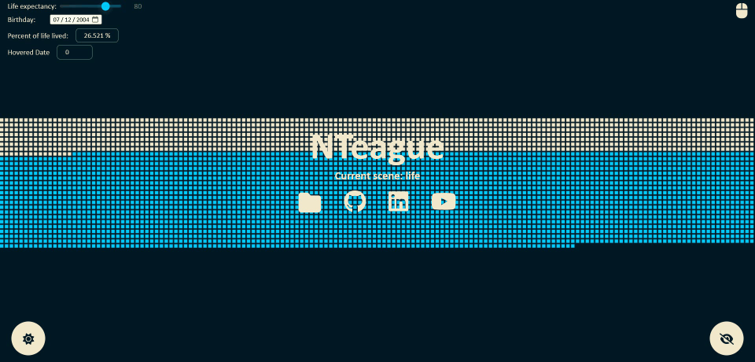

### Raven:
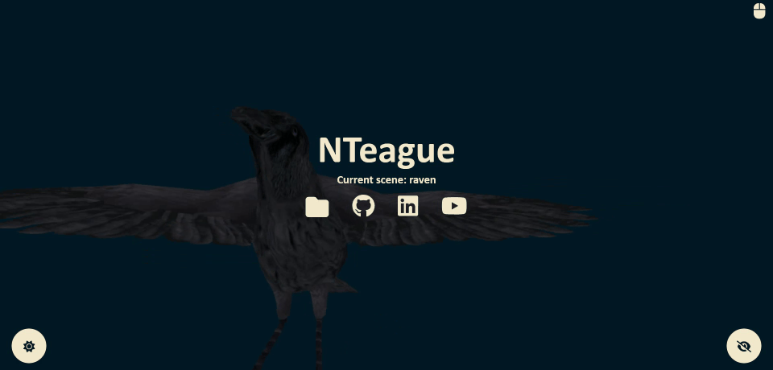

### Clocks:
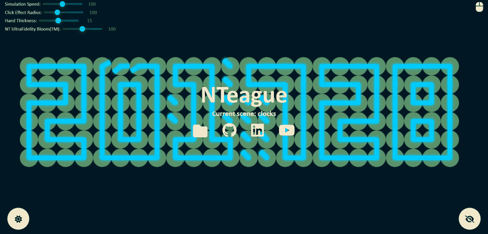

### Pinball:
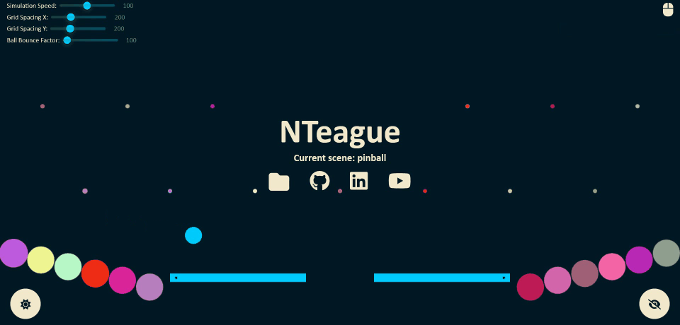

### Ballpit:
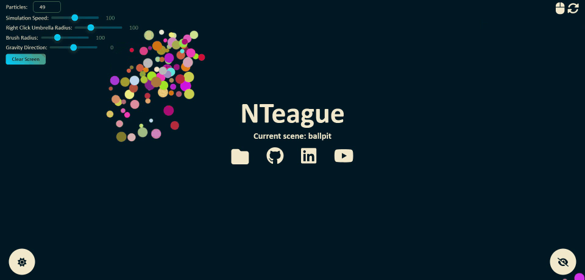

### Pid:
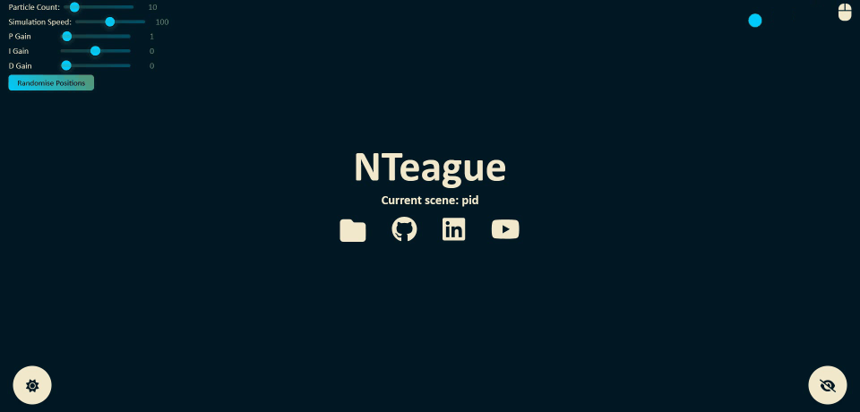

## Hex tool

A second app built from the same `app/` source tree, for its own subdomain:
paste a hex or binary word and read it back in the other base, column by
column, with Verilog bit selects (`0xDEADBEEF[13]`, `[31:16]`, `[16 +: 16]`).

It shares the site's theming and mobile context by importing them directly.
`REACT_APP_TARGET=hextool` swaps the root component in `src/index.js`, so the
two apps are separate chunks and neither build ships the other's code. The same
page is also reachable from the portfolio at `/#/hextool`.

`make build_hextool` writes `app/build-hextool`, which is what the subdomain's
document root gets.

### Reaching it from the main site

The `desktop` scene (`?scene=desktop`) is a Windows XP desktop: the subdomain
utilities are shortcuts on it, and a Scenes folder holds every other scene, so
it doubles as a way around the rest of them. Double-click to open, or use the
start menu. Shortcuts drag around the desktop and snap to the grid, and the
folder is draggable and resizable.

The page's own theme and hide-UI buttons are suppressed while this scene is
showing — `Title` reports the current scene up to `App` for that — and the
desktop carries the same two controls as programs instead, which is what lets
the taskbar sit in the corner at XP's height rather than being pushed out of
the way of two floating circles.

The Luna chrome uses XP's own colours rather than the site theme's: the taskbar
blue, the green start button and the beige window face are the whole
recognition, and deriving them from the theme's cyan just produced a generic
blue desktop. The wallpaper is the exception — the Bliss hill is drawn from
`theme.secondaryAccent`, and the sky goes to dusk on the dark theme.

Every shortcut comes from `SUBDOMAIN_APPS` in `app/src/subdomains.js` — a new
utility is one entry there and nothing else. Give it a `localPath` and the
desktop still opens something when the site is being run from localhost, where
the subdomains do not exist. The same module's `homeHref()` is what the
utilities link back to.

## Make Commands:

`make install` -> Install JS deps

`make run` -> Run webpack to render website locally

`make run_hextool` -> Run the hex tool locally

`make build` -> Build the portfolio into `app/build`

`make build_hextool` -> Build the hex tool into `app/build-hextool`

`make build_all` -> Build both

`make test` -> Run the unit tests

`make clean` -> Clear out node_modules
